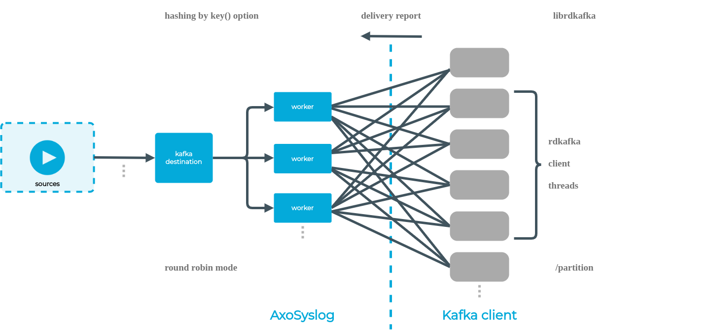

<!-- DISCLAIMER: This file is based on the syslog-ng Open Source Edition documentation https://github.com/balabit/syslog-ng-ose-guides/commit/2f4a52ee61d1ea9ad27cb4f3168b95408fddfdf2 and is used under the terms of The syslog-ng Open Source Edition Documentation License. The file has been modified by Axoflow. -->

{} can directly publish log messages to the [Apache Kafka](http://kafka.apache.org) message bus, where subscribers can access them.

The `kafka-c()` destination uses the [librdkafka](https://github.com/confluentinc/librdkafka) client library, which scales well, uses memory efficiently, and needs no Java runtime. It replaces the earlier Java implementation, which {} has removed. If you're migrating a configuration written for the Java implementation, see {}.

You can also configure this destination under the name `kafka()`, which is an SCL alias for `kafka-c()`. For details, see [kafka: Publish messages to Apache Kafka]().

## Prerequisites

- {} version 3.21 or later.
- 
