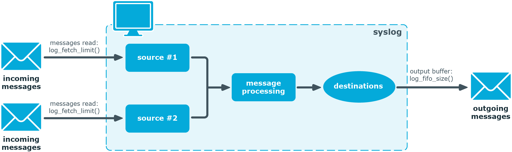

<!-- DISCLAIMER: This file is based on the syslog-ng Open Source Edition documentation https://github.com/balabit/syslog-ng-ose-guides/commit/2f4a52ee61d1ea9ad27cb4f3168b95408fddfdf2 and is used under the terms of The syslog-ng Open Source Edition Documentation License. The file has been modified by Axoflow. -->

This section describes the internal message-processing model of `syslog-ng`, as well as the flow-control feature that can prevent message losses.

The AxoSyslog application monitors (polls) the sources defined in its configuration file, periodically checking each source for messages. When a log message is found in one of the sources, AxoSyslog polls every source and reads the available messages. These messages are processed and put into the output buffer of AxoSyslog (also called fifo). From the output buffer, the operating system sends the messages to the appropriate destinations.

In large-traffic environments many messages can arrive during a single poll loop, therefore AxoSyslog reads only a fixed number of messages from each source. The `log-fetch-limit()` option specifies the number of messages read during a poll loop from a single source.



TCP and unix-stream sources can receive the logs from several incoming connections (for example, many different clients or applications). For such sources, AxoSyslog reads messages from every connection, thus the `log-fetch-limit()` parameter applies individually to every connection of the source.


## Log paths without flow-control

Every destination has its own output buffer. The output buffer is needed because the destination might not be able to accept all messages immediately. The `log-fifo-size()` parameter sets the size of the output buffer. The output buffer must be larger than the `log-fetch-limit()` of the sources, to ensure that every message read during the poll loop fits into the output buffer. If the log path sends messages to a destination from multiple sources, the output buffer must be large enough to store the incoming messages of every source.


## Log paths with flow-control

The AxoSyslog application uses flow-control in the following cases:

- Hard flow-control: the `flow-control` flag is enabled for the particular log path, or the [`log-flow-control()` global option]() is set. You can selectively disable flow control for individual log paths using the `no-flow-control` flag.

    

- Soft flow-control: the log path includes a file destination.

{}

The way flow-control works has changed significantly in version {} 3.22. If you are using an older version of {}, consult the documentation of the version you are using for details about flow-control.

{}

The flow-control of AxoSyslog introduces a control window to the source that tracks how many messages can AxoSyslog accept from the source. Every message that AxoSyslog reads from the source lowers the window size by one, every message that AxoSyslog successfully sends from the output buffer increases the window size by one. If the window is full (that is, its size decreases to zero), AxoSyslog stops reading messages from the source. The initial size of the control window is by default `100`. If a source accepts messages from multiple connections, all messages use the same control window.

When using flow-control, AxoSyslog automatically sets the size of the output buffer so that it matches the size of the control window of the sources. Note that starting with {} 3.22, `log-fifo-size()` only affects log paths that are not flow-controlled.

{}

If the source can handle multiple connections (for example, `network()` and `syslog()`), the size of the control window is divided by the value of the `max-connections()` parameter and this smaller control window is applied to each connection of the source.

For UDP-based sources, the window size is not divided by `max-connections()`, because UDP-based traffic is treated as a single connection for the source. Also, flow control has no effect on UDP-based traffic, because there's no way to notify the peers that their messages cannot be processed. For UDP sources, we recommend configuring appropriately sized [disk buffers]().

{}


## Dynamic flow-control

In addition to the static control window set using the `log-iw-size()` option, you can also allocate a dynamic window to the source. The AxoSyslog application uses this window to dynamically increase the static window of the active connections. The dynamic window is distributed evenly among the active connections of the source. The AxoSyslog application periodically checks which connections of the source are active, and redistributes the dynamic window. If only one of the connections is active, it receives the entire dynamic window, while other connections receive only their share of the static window.



Using dynamic flow-control on your AxoSyslog server is useful when the source has lots of connections, but only a small subset of the active clients send messages at high rate, and the memory of the AxoSyslog server is limited. In other cases, it is currently not recommended, because it can result in higher memory usage and fluctuating performance compared to using only the static window.

When flow-control is used, every source has its own control window. As a worst-case situation, memory of the host must be greater than the total size of the messages of every control window, plus the size of the dynamic window, that is, the `log-iw-size()`+`dynamic-window-size()`. This applies to every source that sends logs to the particular destination. Thus if two sources having several connections and heavy traffic send logs to the same destination, the control window of both sources must fit into the memory of the host. Otherwise, some messages might not fit in the memory, and messages may be lost.

If dynamic flow-control is disabled (which is the default behavior), the value of the `log-iw-size()` option cannot be lower than 100. If dynamic flow-control is enabled, you can decrease the value of the `log-iw-size()` option (to the minimum of 1).


In case of soft flow-control there is no message lost if the destination can accept messages. It is possible to lose messages if it cannot accept messages (for example, the file destination is not writable, or the disk becomes full), and all buffers are full. Soft flow-control cannot be configured, it is automatically available for file destinations.

*Hard flow-control:* In case of hard flow-control there is no message lost. To use hard flow-control, enable the `flow-control` flag in the log path. Hard flow-control is available for all destinations.


## Example: Soft flow-control

```shell
   source s_file {
        file("/tmp/input_file.log");
    };
    destination d_file {
        file("/tmp/output_file.log");
    };
    destination d_tcp {
        network("127.0.0.1"
            port(2222)
        );
    };
    log {
        source(s_file);
        destination(d_file);
        destination(d_tcp);
    };
```


{}

Hazard of data loss! For destinations other than file, soft flow-control is not available. Thus, it is possible to lose log messages on those destinations. To avoid data loss on those destinations, use hard flow-control.

{}


## Example: Hard flow-control

```shell
   source s_file {
        file("/tmp/input_file.log");
    };
    destination d_file {
        file("/tmp/output_file.log");
    };
    destination d_tcp {
        network("127.0.0.1"
            port(2222)
        );
    };
    log {
        source(s_file);
        destination(d_file);
        destination(d_tcp);
        flags(flow-control);
    };
```


## Handling outgoing messages

The AxoSyslog application handles outgoing messages the following way:


  - *Output queue*: Messages from the output queue are sent to the target AxoSyslog server. The AxoSyslog application puts the outgoing messages directly into the output queue, unless the output queue is full. The output queue can hold 64 messages, this is a fixed value and cannot be modified.

  - *Disk buffer*: If the output queue is full and disk-buffering is enabled, AxoSyslog puts the outgoing messages into the disk buffer of the destination.

  - *Overflow queue*: If the output queue is full and the disk buffer is disabled or full, AxoSyslog puts the outgoing messages into the overflow queue of the destination. (The overflow queue is identical to the output buffer used by other destinations.) The `log-fifo-size()` parameter specifies the number of messages stored in the overflow queue, unless flow-control is enabled. When dynamic flow-control is enabled, AxoSyslog sets the size of the overflow queue automatically. For details on sizing the `log-fifo-size()` parameter, see {}.

