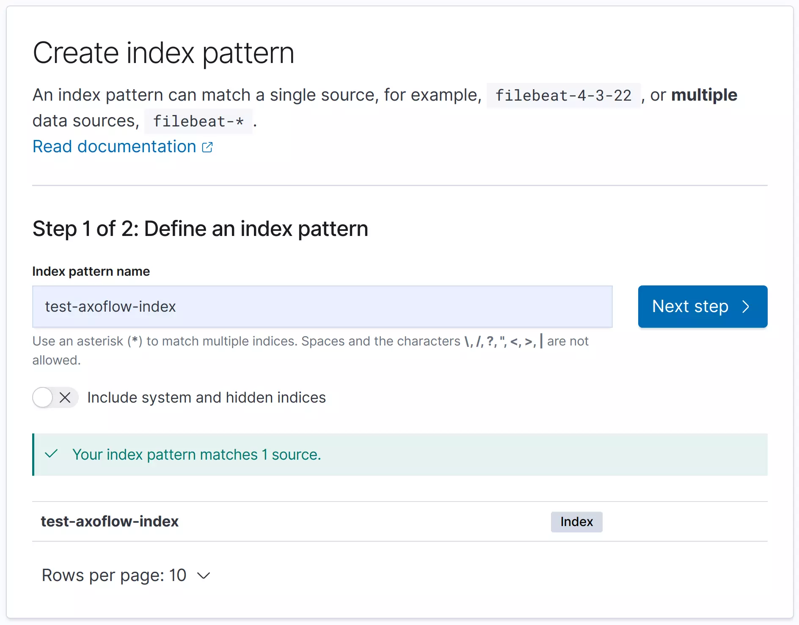
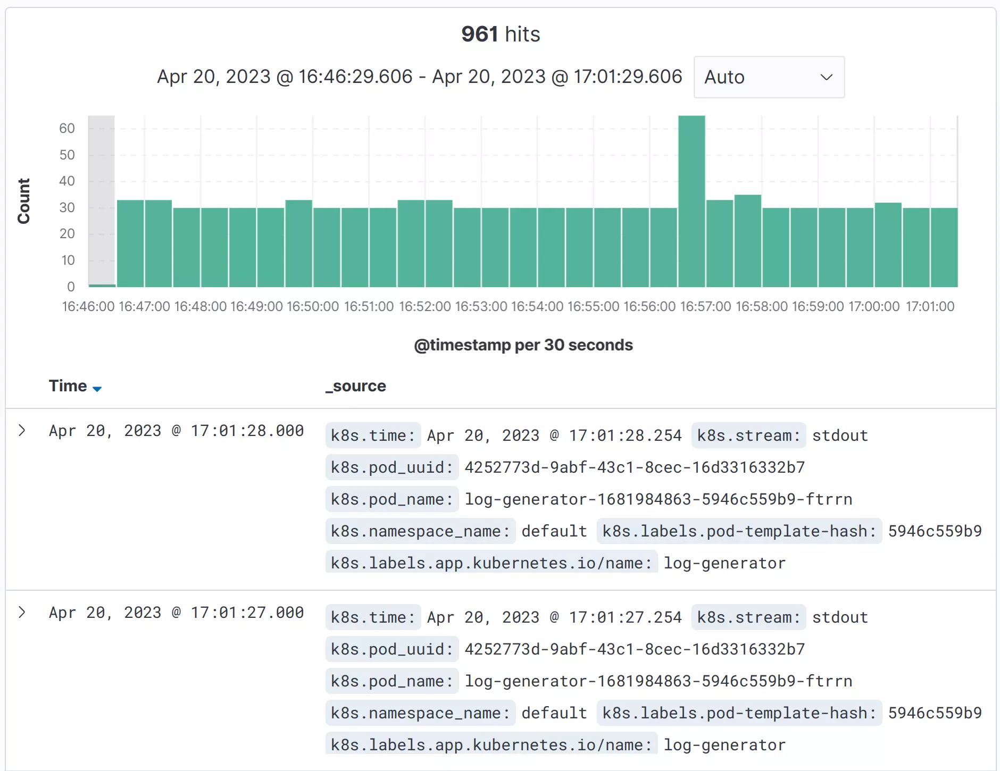
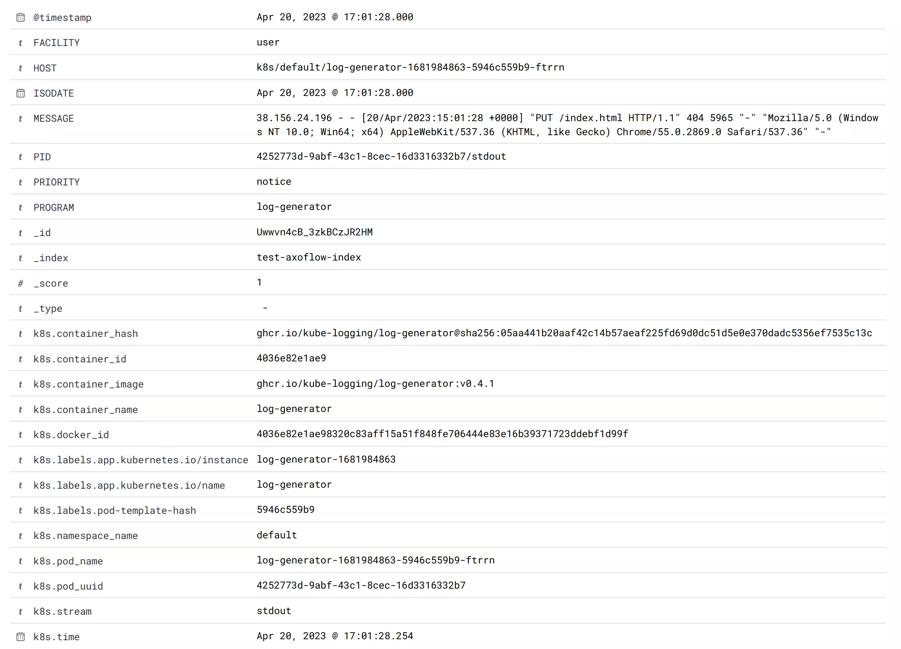

<!-- This file is under the copyright of Axoflow, and licensed under Apache License 2.0, except for using the Axoflow and AxoSyslog trademarks. -->

The following tutorial shows you how to install {} on Kubernetes, deploy OpenSearch to the same cluster, and send Kubernetes logs to OpenSearch.


## Prerequisites

You need:

- A Kubernetes cluster. We used [minikube](https://minikube.sigs.k8s.io/docs/) with docker driver and Helm. We used a Ubuntu 22.04 (amd64) machine, but it should work on any system that can run minikube (2 CPUs, 2GB of free memory, 20GB of free disk space).

    The OpenSearch service needs a large mmap count setting, so set it to at least 262144, for example:

    ```bash
    sysctl -w vm.max_map_count=262144
    ```

- [Helm](https://helm.sh) and [kubectl](https://kubernetes.io/docs/tasks/tools/) installed.

## Generate logs

If you don't already have an application that generates logs deployed to the Kubernetes cluster, install `kube-logging/log-generator` to generate sample logs. Complete the following steps.

1. Add the `kube-logging` repository to Helm.

    ```bash
    helm repo add kube-logging https://kube-logging.github.io/helm-charts
    ```

    Expected output:

    ```bash
    "kube-logging" has been added to your repositories
    ```

1. Update your repositories.

    ```bash
    helm repo update
    ```

    The output should look like:

    ```bash
    Hang tight while we grab the latest from your chart repositories...
    ...Successfully got an update from the "kube-logging" chart repository
    Update Complete. ⎈Happy Helming!⎈
    ```

1. Install `kube-logging/log-generator`.

    ```bash
    helm install --generate-name --wait kube-logging/log-generator
    ```

    The output should look like:

    ```bash
    NAME: log-generator-1684694629
    LAST DEPLOYED: Sun May 21 20:43:49 2023
    NAMESPACE: default
    STATUS: deployed
    REVISION: 1
    TEST SUITE: None
    ```

1. Check that the `log-generator` is running:

    ```bash
    kubectl get pods
    ```

    The output should look like:

    ```bash
    NAME                                        READY   STATUS        RESTARTS       AGE
    log-generator-1681984863-5946c559b9-ftrrn   1/1     Running       0              8s
    ```

## Set up OpenSearch

1. Install an OpenSearch cluster with Helm:

    ```bash
    helm repo add opensearch https://opensearch-project.github.io/helm-charts/
    ```

    Expected output:

    ```bash
    "opensearch" has been added to your repositories
    ```

1. Update your repositories.

    ```bash
    helm repo update
    ```

    The output should look like:

    ```bash
    Hang tight while we grab the latest from your chart repositories...
    ...Successfully got an update from the "opensearch" chart repository
    Update Complete. ⎈Happy Helming!⎈
    ```

1. Install OpenSearch. This step can take a few minutes.

    ```bash
    helm install --generate-name --wait opensearch/opensearch
    ```

1. Install the OpenSearch dashboards.

    ```bash
    helm install --generate-name --wait opensearch/opensearch-dashboards
    ```

    The output should look like:

    ```bash
    NAME: opensearch-dashboards-1684695728
    LAST DEPLOYED: Sun May 21 21:02:09 2023
    NAMESPACE: default
    STATUS: deployed
    REVISION: 1
    TEST SUITE: None
    NOTES:
    1. Get the application URL by running these commands:
      export POD_NAME=$(kubectl get pods --namespace default -l "app.kubernetes.io/name=opensearch-dashboards,app.kubernetes.io/instance=opensearch-dashboards-1684695728" -o jsonpath="{.items[0].metadata.name}")
      export CONTAINER_PORT=$(kubectl get pod --namespace default $POD_NAME -o jsonpath="{.spec.containers[0].ports[0].containerPort}")
      echo "Visit http://127.0.0.1:8080 to use your application"
      kubectl --namespace default port-forward $POD_NAME 8080:$CONTAINER_PORT
    ```

1. Now you should have 5 pods. Check that they exist:

    ```bash
    kubectl get pods
    ```

    The output should look like:

    ```bash
    NAME                                                READY   STATUS    RESTARTS   AGE
    log-generator-1681984863-5946c559b9-ftrrn           1/1     Running   0          3m39s
    opensearch-cluster-master-0                         1/1     Running   0          81s
    opensearch-cluster-master-1                         1/1     Running   0          81s
    opensearch-cluster-master-2                         1/1     Running   0          81s
    opensearch-dashboards-1681999620-59f64f98f7-bjwwh   1/1     Running   0          44s
    ```

1. Forward the 5601 port of the OpenSearch Dashboards service (replace the name of the pod with your pod).

    ```bash
    kubectl port-forward <name-of-your-opensearch-dashboards-pod> 8080:5601
    ```

    The output should look like:

    ```bash
    Forwarding from 127.0.0.1:8080 -> 5601
    Forwarding from [::1]:8080 -> 5601
    ```

1. Log in to the dashboard at `http://localhost:8080` with admin/admin. You will soon create an Index Pattern here, but first you have to send some logs from `syslog-ng`.

## Set up axosyslog-collector

1. Add the AxoSyslog Helm repository:

    ```bash
    helm repo add axosyslog https://axoflow.github.io/axosyslog-charts
    helm repo update
    ```

1. Create a YAML file (called `axoflow-demo.yaml` in the examples) to configure the collector.

    ```yaml
    config:
      sources:
        kubernetes:
          # Collect kubernetes logs
          enabled: true
      destinations:
        # Send logs to OpenSearch
        opensearch:
          - address: "opensearch-cluster-master"
            index: "test-axoflow-index"
            user: "admin"
            password: "admin"
            tls:
              # Do not validate the server's TLS certificate.
              peerVerify: false
            # Send the syslog fields + the metadata from .k8s.* in JSON format
            template: "$(format-json --scope rfc5424 --exclude DATE --key ISODATE @timestamp=${ISODATE} k8s=$(format-json .k8s.* --shift-levels 2 --exclude .k8s.log))"
    ```

1. Check how the `syslog-ng.conf` file looks with your custom values:

    ```bash
    helm template -f axoflow-demo.yaml -s templates/config.yaml axosyslog/axosyslog-collector
    ```

    The output should look like:

    ```yaml
    # Source: axosyslog-collector/templates/config.yaml
    apiVersion: v1
    kind: ConfigMap
    metadata:
      labels:
        helm.sh/chart: axosyslog-collector-0.3.0
        app.kubernetes.io/name: axosyslog-collector
        app.kubernetes.io/instance: release-name
        app.kubernetes.io/version: "4.2.0"
        app.kubernetes.io/managed-by: Helm
      name: release-name-axosyslog-collector
    data:
      syslog-ng.conf: |
        @version: current
        @include "scl.conf"

        options {
          stats(
            level(1)
          );
        };

        log {
          source { kubernetes(); };
          destination {
            elasticsearch-http(
              url("https://opensearch-cluster-master:9200/_bulk")
              index("test-axoflow-index")
              type("")
              template("$(format-json --scope rfc5424 --exclude DATE --key ISODATE @timestamp=${ISODATE} k8s=$(format-json .k8s.* --shift-levels 2 --exclude .k8s.log))")
              user("admin")
              password("admin")
              tls(
                peer-verify(no)
              )
            );
          };
        };
    ```

1. Install the `axosyslog-collector` chart:

    ```bash
    helm install --generate-name --wait -f axoflow-demo.yaml axosyslog/axosyslog-collector
    ```

    The output should look like:

    ```bash
    NAME: axosyslog-collector-1682002179
    LAST DEPLOYED: Thu Apr 20 16:49:39 2023
    NAMESPACE: default
    STATUS: deployed
    REVISION: 1
    TEST SUITE: None
    NOTES:
    1. Watch the axosyslog-collector-1682002179 container start.
    ```

1. Check your pods:

    ```bash
    kubectl get pods --namespace=default -l app=axosyslog-collector-1682002179 -w
    kubectl get pods
    ```

    The output should look like:

    ```bash
    NAME                                                READY   STATUS    RESTARTS   AGE
    log-generator-1681984863-5946c559b9-ftrrn           1/1     Running   0          13m
    opensearch-cluster-master-0                         1/1     Running   0          11m
    opensearch-cluster-master-1                         1/1     Running   0          11m
    opensearch-cluster-master-2                         1/1     Running   0          11m
    opensearch-dashboards-1681999620-59f64f98f7-bjwwh   1/1     Running   0          10m
    axosyslog-collector-1682002179-pjlkn                1/1     Running   0          6s
    ```

## Check the logs in OpenSearch

1. Open OpenSearch dashboard at `http://localhost:8080/app/management/opensearch-dashboards/`.
1. Create an Index Pattern called `test-axoflow-index`: `http://localhost:8080/app/management/opensearch-dashboards/indexPatterns`. At Step 2, set the **Time** field to `@timestamp`.

    

1. Now you can see your logs on the Discover view at `http://localhost:8080/app/discover`. Opening the detailed view for a log entry shows you the fields sent to OpenSearch.

    
    
